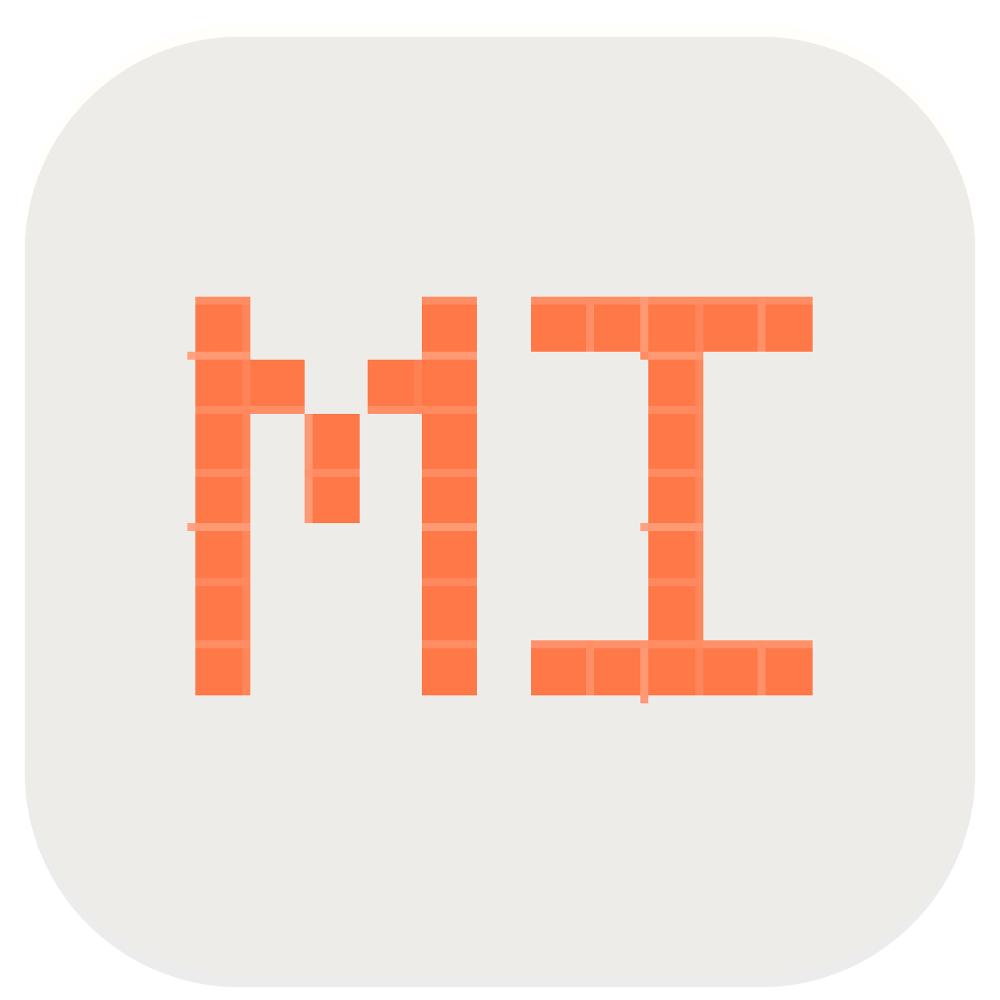

# MIMO Work

<p align="center">
  
</p>

MIMO Work is a desktop agent workbench built around the MiMo-Code runtime. It focuses on software engineering tasks such as coding, debugging, architecture design, document generation, planning, reviews, automation, and tool-assisted workflows.

## Highlights

- **MiMo-Code core**: local runtime integration for sessions, streaming events, permissions, questions, skills, memory, MCP tools, usage, and generated artifacts.
- **MIMO providers first**: built-in support for MiMo recharge mode and Token Plan mode, plus custom OpenAI-compatible providers.
- **Project workflow**: project-scoped conversations, workspace selection, Git context, file references, side conversations, checkpoints, and review surfaces.
- **Engineering guardrails**: bundled MIMO Work guardrails, Speckit support, Oh My Codex oriented workflows, and optional external skills/MCP servers.
- **Desktop app**: macOS-first Electron application with packaged runtime resources and local-only service defaults.

## Quick Start

```bash
npm install
npm run dev
```

For a packaged macOS directory build:

```bash
npm run dist:mac:dir
```

The app stores local preferences and runtime files under the MIMO Work application data directory. API keys are treated as credentials and should not be committed.

## Runtime

MIMO Work keeps a stable local `/v1/*` desktop boundary for the renderer while forwarding runtime work to MiMo-Code. This preserves the existing desktop UX while using MiMo sessions, events, permissions, questions, and model/provider configuration underneath.

## Release

Release artifacts use the `MIMO-Work-${version}-${os}-${arch}` naming scheme. See `electron-builder.config.cjs` and `scripts/` for macOS, Windows, Linux, and R2 publishing helpers.

## Notices

MIMO Work is a derivative desktop workbench with a MiMo-Code-based runtime. Keep upstream notices and license requirements intact when redistributing.
